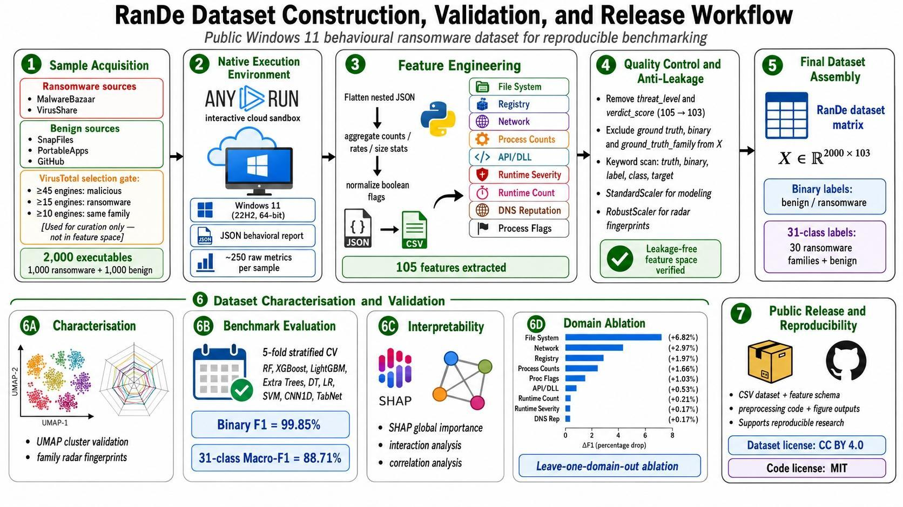
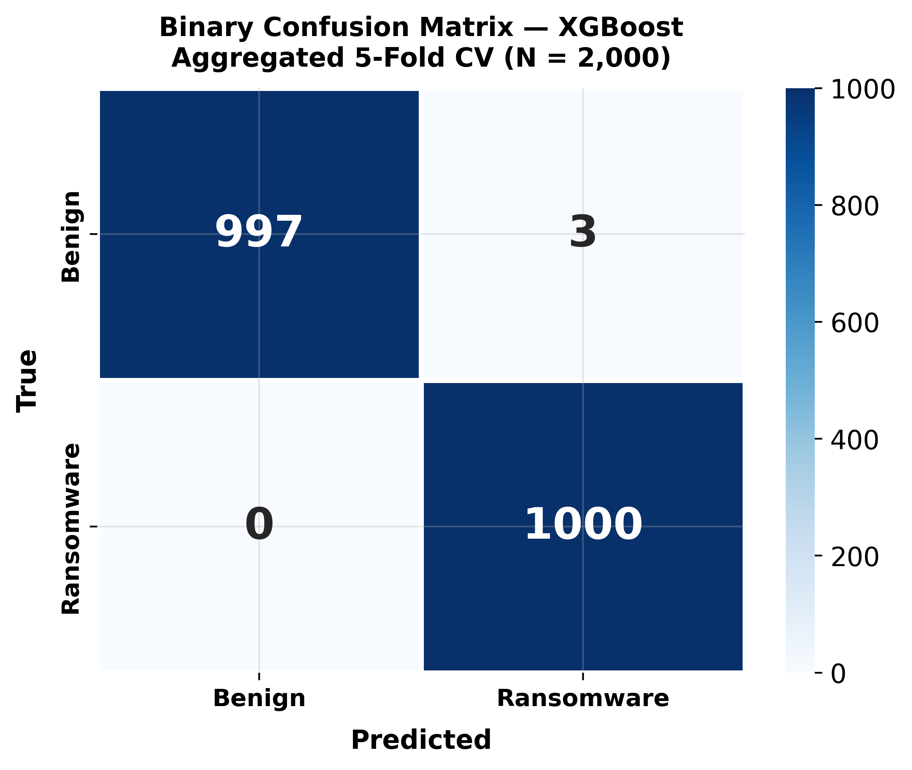
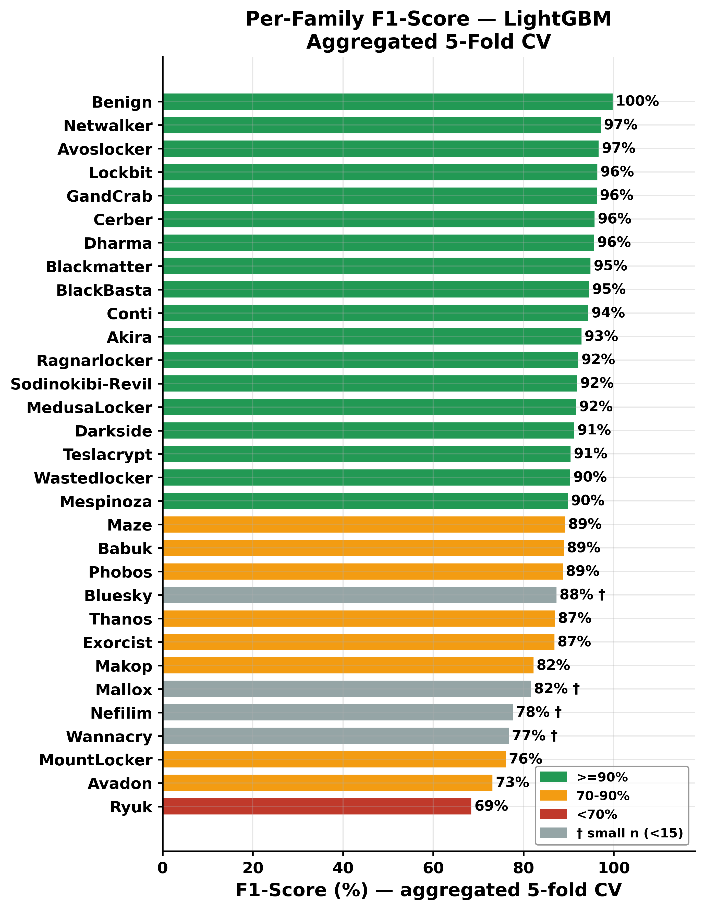
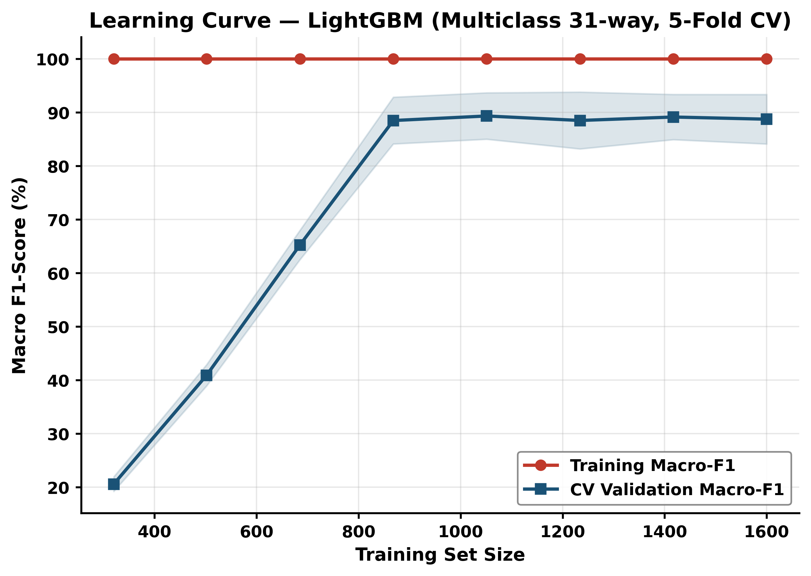
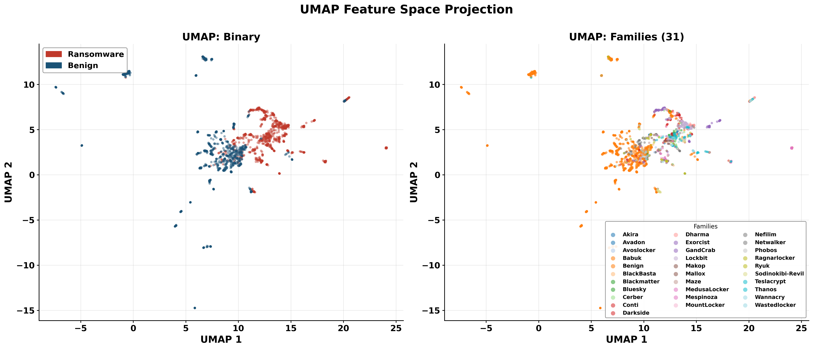
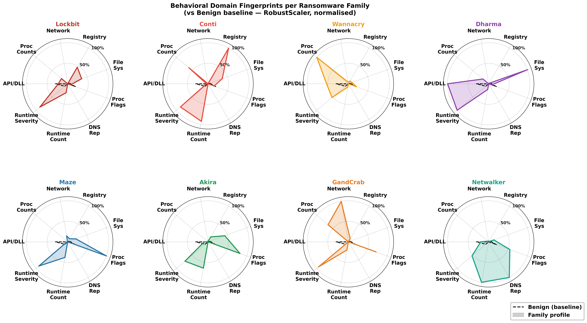
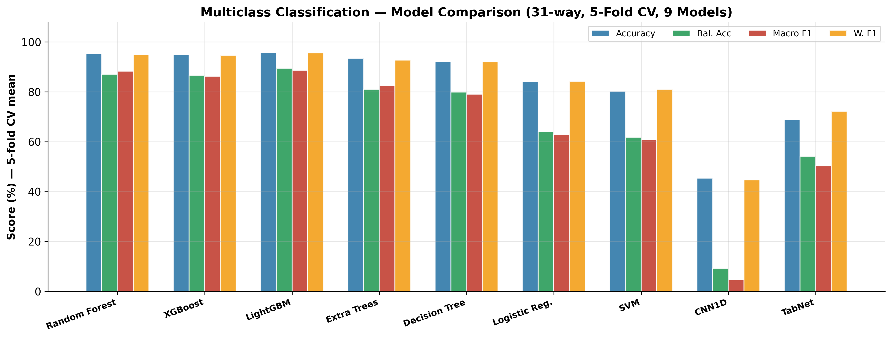
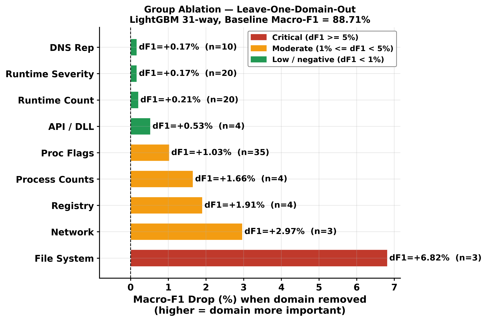

<h1 align="center">RanDe: A Realistic Behavioral Dataset for Enhancing Ransomware Detection</h1>

<p align="center">
  
  
  
  
  
  <!--  — add when published -->
  <!--  — add when DOI assigned -->
</p>
<p align="center">
  <b>Jannatul Ferdous, Rafiqul Islam, Arash Mahboubi and Md Zahidul Islam</b><br/>
  Charles Sturt University, NSW, Australia
</p>

---

## Overview

**RanDe** is a balanced behavioral dataset of Windows executable samples, designed for
machine learning-based ransomware research on modern Windows 11 environments. It addresses
a critical gap in existing datasets, which predominantly target Windows 7/10 and rely on
legacy Cuckoo-based infrastructure.

<p align="center">
  
</p>

Each sample was dynamically analyzed using [Any.run](https://any.run) interactive sandbox,
producing rich behavioral telemetry across nine feature domains: file system activity,
registry operations, network behavior, process dynamics, API/DLL usage, runtime event
sequences, DNS reputation profiling, and per-process behavioral flags.

| Property | Value |
|---|---|
| Total Samples | 2,000 |
| Ransomware Samples | 1,000 |
| Benign Samples | 1,000 |
| Ransomware Families | 30 |
| Total Classes (multiclass) | 31 (30 families + Benign) |
| Features | 103 behavioral features |
| Target Platform | Windows 11 |
| Sandbox | Any.run |
| Label Format | `ground_truth_family`, `ground_truth_binary` |

The key contributions of this dataset are as follows:

1. **Windows 11 native behavioral dataset** — 2,000 balanced benign and ransomware executions across 30 families and 103 features spanning nine semantic domains, constructed natively on Windows 11 (24H2, 64-bit) using the ANY.RUN interactive cloud sandbox.
2. **Reproducible dynamic telemetry pipeline** — a feature engineering protocol that converts ANY.RUN sandbox JSON telemetry into a structured ML-ready matrix for binary and family-level ransomware benchmarking, reducing dependence on legacy Cuckoo-based pipelines.
3. **Two-stage anti-leakage verification** — sandbox verdict fields removed, label columns excluded by construction, and a secondary keyword audit applied to reduce target-proxy contamination and improve benchmark trustworthiness.
4. **Multi-layer behavioral validation** — UMAP cluster validation, multi-domain radar fingerprinting, and SHAP-based interpretability confirm that classifiers trained on RanDe align with genuine ransomware behavioral signals rather than sampling artifacts.
5. **Feature-domain ablation** — leave-one-domain-out analysis identifies that filesystem, network, and registry domains provide the most discriminative signals, demonstrating that information density rather than feature count guides domain value.
6. **Reproducible ML benchmark** — nine classifiers under unified 5-fold stratified CV deliver XGBoost binary F1 = 99.85% and LightGBM 31-way Macro-F1 = 88.71% as community reference results.
---

## Ransomware Families

Families were selected based on two criteria: (1) frequency and impact documented across seven years of threat intelligence reports (2019–2025), and (2) confirmation by at least two independent cybersecurity firm reports.

| Family | n | Family | n | Family | n |
|---|---|---|---|---|---|
| Lockbit | 114 | Sodinokibi-Revil | 43 | Makop | 23 |
| GandCrab | 97 | Darkside | 41 | Akira | 22 |
| MedusaLocker | 63 | Dharma | 36 | Phobos | 22 |
| Netwalker | 56 | Thanos | 31 | Wannacry | 21 |
| Conti | 55 | Teslacrypt | 31 | Wastedlocker | 20 |
| Babuk | 52 | Avoslocker | 15 | Blackmatter | 20 |
| Cerber | 49 | Avadon | 14 † | BlackBasta | 20 |
| Maze | 47 | MountLocker | 11 † | Ryuk | 20 |
| Ragnarlocker | 19 | Exorcist | 11 † | Mallox | 10 † |
| Mespinoza | 19 | Nefilim | 10 † | Bluesky | 8 † |

† Small-n families (n < 15). Per-family F1 results account for this imbalance; see paper Section V.

---

## Feature Domains

RanDe organizes its 103 features into nine behavioral domains extracted from Any.run sandbox reports. The indexed naming convention (e.g., `runtime_0_event_count` ... `runtime_19_event_count`) reflects **ordered sandbox observations** — not derived labels. See [`dataset/FEATURE_GUIDE.md`](dataset/FEATURE_GUIDE.md) for the full explanation.

| Domain | Features | Description |
|---|---|---|
| File System | 3 | Modified file count, average and max size |
| Registry | 4 | Total, read, write, delete registry operations |
| Network | 3 | HTTP requests, DNS queries, connection count |
| Process Counts | 4 | Runtime, monitored, anomalous, irregular processes |
| API / DLL | 4 | API categories, total calls, DLL loads, file drops |
| Runtime Severity | 20 | Ordered event severity across 20 sandbox ticks |
| Runtime Count | 20 | Ordered event count across 20 sandbox ticks |
| DNS Reputation | 10 | Risk profiles of up to 10 contacted DNS endpoints |
| Process Flags | 35 | Per-process behavioral flags across 5 observed processes |
| **Total** | **103** | |

---

## Validation Results

The dataset was validated using a unified 5-fold stratified cross-validation protocol across 9 classifiers (7 classical + CNN1D + TabNet). Results below are mean ± std across folds.

### Binary Classification (Ransomware vs. Benign)

| Model | Accuracy | Bal. Acc | F1 | AUC-ROC |
|---|---|---|---|---|
| **XGBoost** ★ | **99.85 ± 0.1%** | **99.85 ± 0.1%** | **99.85 ± 0.1%** | **100.00 ± 0.0%** |
| LightGBM | 99.85 ± 0.2% | 99.85 ± 0.2% | 99.85 ± 0.2% | 100.00 ± 0.0% |
| Random Forest | 99.80 ± 0.2% | 99.80 ± 0.2% | 99.80 ± 0.2% | 100.00 ± 0.0% |
| Extra Trees | 99.75 ± 0.2% | 99.75 ± 0.2% | 99.75 ± 0.2% | 100.00 ± 0.0% |
| TabNet | 98.60 ± 0.6% | 98.60 ± 0.6% | 98.61 ± 0.6% | 99.92 ± 0.1% |
| Logistic Reg. | 98.80 ± 0.3% | 98.80 ± 0.3% | 98.79 ± 0.3% | 99.81 ± 0.3% |
| Decision Tree | 99.65 ± 0.2% | 99.65 ± 0.2% | 99.65 ± 0.2% | 99.65 ± 0.2% |
| SVM | 98.15 ± 0.4% | 98.15 ± 0.4% | 98.13 ± 0.4% | 99.88 ± 0.0% |
| CNN1D | 87.60 ± 1.5% | 87.60 ± 1.5% | 87.51 ± 1.4% | 93.64 ± 1.5% |

★ Best binary model

### Multiclass Classification (31-way family identification)

| Model | Accuracy | Bal. Acc | Macro F1 | Wtd. F1 |
|---|---|---|---|---|
| **LightGBM** ★ | **95.75 ± 1.6%** | **89.40 ± 5.1%** | **88.71 ± 4.6%** | **95.63 ± 1.7%** |
| Random Forest | 95.20 ± 1.1% | 87.03 ± 3.5% | 88.28 ± 3.0% | 94.87 ± 1.2% |
| XGBoost | 94.85 ± 1.4% | 86.60 ± 4.6% | 86.24 ± 4.4% | 94.69 ± 1.5% |
| Extra Trees | 93.50 ± 1.5% | 81.08 ± 4.6% | 82.49 ± 4.7% | 92.75 ± 1.7% |
| Decision Tree | 92.15 ± 1.1% | 79.89 ± 2.6% | 79.09 ± 2.5% | 92.05 ± 1.0% |
| TabNet | 68.90 ± 2.7% | 54.07 ± 3.8% | 50.30 ± 3.8% | 72.21 ± 2.4% |
| Logistic Reg. | 84.10 ± 2.0% | 64.04 ± 5.1% | 62.85 ± 5.3% | 84.22 ± 2.3% |
| SVM | 80.30 ± 2.7% | 61.72 ± 5.6% | 60.88 ± 5.3% | 81.05 ± 2.4% |
| CNN1D | 45.45 ± 1.9% | 9.20 ± 1.1% | 4.67 ± 0.3% | 44.70 ± 1.2% |

★ Best multiclass model. Macro F1 is the primary reported metric due to class imbalance across families.

---

## Selected Figures

<p align="center">
  
  
</p>

<p align="center">
  
  
</p>

<p align="center">
  
  
</p>

<p align="center">
  
  
</p>

*From left to right: RanDe workflow, binary confusion matrix, per-family F1 scores, learning curve, UMAP projection, behavioral-domain radar, Multiclass Model Comparison Bar, and feature-domain ablation.*

---

## Repository Contents

```
RanDe-W11/
├── dataset/
│   ├── sample_preview.csv          # 10-row schema preview (1 benign + 9 families)
│   └── FEATURE_GUIDE.md            # Full feature-domain explanation and column rationale
├── figures/                        # Selected validation figures
│   ├── Rande-Workflow.jpg
│   ├── fig1_binary_cm.png
│   ├── fig5_per_family_f1.png
│   ├── fig10_learning_curve_mc.png
│   ├── fig12_umap.png
│   ├── fig13_radar.png
│   ├── fig14_mc_bar.png
│   └── fig15_group_ablation.png
├── preprocessings/
│   ├── 01_encode_boolean_features.py
│   ├── 02_leakage_verification.py
│   └── 03_scale_and_split.py       
├── LICENSE
├── CITATION.cff
└── README.md
```
---

## Sample Preview

The file [`dataset/sample_preview.csv`](dataset/sample_preview.csv) contains 10 rows (1 benign + 9 ransomware families) with all 103 features and both label columns. It demonstrates the dataset schema and column naming convention without exposing the full corpus.

---

## Citation

If you use RanDe in your research, please cite:

```bibtex
@article{Ferdous_2026_rande,
  title   = {RanDe: A Realistic Behavioral Dataset for Enhancing Ransomware Detection},
  author  = {Jannatul Ferdous, Rafiqul Islam, Arash Mahboubi and Md Zahidul Islam},
  year    = {2026},
  note    = {Upon request dataset available at: https://drive.google.com/drive/folders/1lEmZYgFk43Md_K1tdinoCADX-3XHLIVt?usp=sharing }
}
```

---

## License

This dataset and associated code are released under the [Creative Commons Attribution 4.0 International (CC BY 4.0)](LICENSE) license. You are free to share and adapt the material for any purpose, provided appropriate credit is given.

---

## Disclaimer

All ransomware samples were analyzed in controlled sandbox environments. This repository does not distribute raw binaries or executable malware. The dataset contains behavioral feature vectors only. Researchers are advised to comply with their institution's ethical and legal standards when working with malware-derived data.
